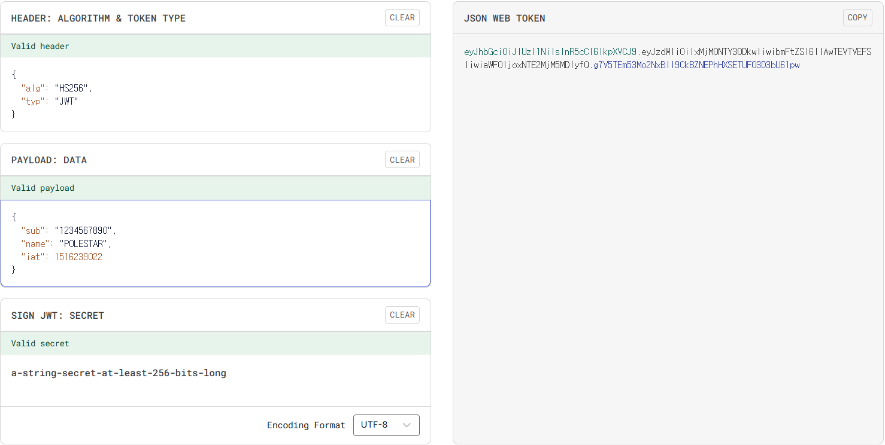
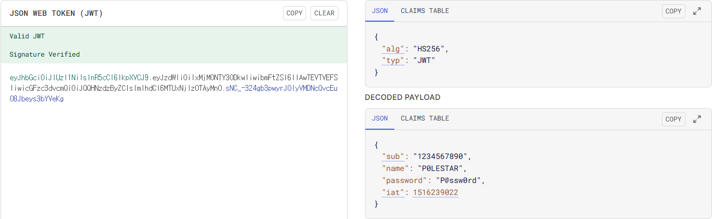

## JWT란 무엇인가?
### 1. JWT의 정의
- **JWT(JSON Web Token)**는 당사자 간 정보를 JSON 객체로 안전하게 전송하기 위한 개방형 표준(RFC 7519)입니다.
- 주로 사용자 인증과 정보 교환에 사용됩니다.

### 2. JWT의 구조
- JWT는 점(.)으로 구분된 세 부분으로 구성됩니다: `xxxxx.yyyyy.zzzzz`

#### 2.1 Header (헤더)
- 토큰 타입과 해싱 알고리즘을 지정합니다.

```json
{
  "alg": "HS256",
  "typ": "JWT"
}
```
#### 2.2 Payload (페이로드)
- 전송할 실제 데이터(Claims)를 담습니다.

```json
{
  "sub": "1234567890",
  "name": "P0LESTAR",
  "iat": 1516239022
}
```

#### 2.3 Signature (서명)
- **Header + Payload**를 비밀키로 서명한 값입니다. 
- 토큰의 무결성을 보장합니다.



#### 2.4 동작 원리

1. 사용자가 로그인
2. 서버가 JWT 생성 후 클라이언트에 전달
3. 클라이언트는 요청 시마다 JWT를 Header에 포함
4. 서버는 서명을 검증하여 인증 처리

#### 3. 세션 방식과의 차이

| 구분 | **세션 방식** | **JWT 방식** |
|------|-----------|----------|
| 상태 관리 | Stateful (서버에 세션 저장) | Stateless (서버에 저장 안 함) |
| 저장 위치 | 서버 메모리/DB | 클라이언트 (쿠키/localStorage) |
| 확장성 | 세션 동기화 필요 | 수평 확장 용이 |
| 서버 부하 | 세션 저장소 부하 | 토큰 검증 연산만 필요 |
| 토큰 무효화 | 즉시 가능 | 어려움 (만료 시까지 유효) |
| 데이터 노출 | 세션ID만 노출 | Payload 디코딩 가능 (암호화 아님) |
| 네트워크 부하 | 작음 (세션ID만 전송) | 큼 (토큰 전체 전송) |

<br><br>

---

## JWT의 보안 취약점

### 1. 서명 검증 우회 (alg: none 공격)
- 일부 JWT 라이브러리는 Header의 `alg 필드`를 `none`으로 설정하면 서명 검증을 건너뜁니다.


```json
{
  "alg": "none",
  "typ": "JWT"
}
```

- 공격자가 alg를 **none으로 변조하고 서명 부분을 제거**하면, 검증 로직이 없는 서버는 이를 유효한 토큰으로 인식합니다.
- 방어: 서버에서 **alg: none을 명시적으로 거부**해야 합니다.

### 2. 약한 비밀키 (Weak Secret)
- HS256 같은 대칭키 알고리즘 사용 시, 짧거나 예측 가능한 비밀키는 **brute force 공격에 취약**합니다.
- 공격자는 토큰을 수집하여 오프라인에서 비밀키를 추측할 수 있습니다.
- 방어: 최소 256비트 이상의 강력한 랜덤 키 사용, RS256 같은 비대칭 알고리즘 고려.

### 3. 토큰 탈취 경로
- **XSS** 
    - JavaScript로 토큰에 접근 가능한 경우, XSS 공격으로 탈취됩니다.

    ```
    localStorage.getItem('token')
    sessionStorage.getItem('token')
    HttpOnly 플래그 없는 쿠키
    ```

- **중간자 공격 (MITM)**
- **피싱/소셜 엔지니어링**

### 4. 저장소 문제

| 저장 방식 | XSS 취약성 | CSRF 취약성 | 접근성 |
|-----------|-----------|-------------|--------|
| localStorage | 높음 | 낮음 | JS로 자유롭게 접근 |
| sessionStorage | 높음 | 낮음 | JS로 자유롭게 접근 |
| Cookie (일반) | 높음 | 높음 | JS로 접근 가능 |
| Cookie (HttpOnly) | 낮음 | 높음 | JS 접근 불가 |
| Cookie (HttpOnly + SameSite) | 낮음 | 낮음 | 가장 안전 |

### 5. 알고리즘 혼동 공격
- RS256(비대칭)으로 발급된 토큰을 HS256(대칭)으로 검증하도록 유도하는 공격입니다.

- 공격 시나리오:

```
1. 공격자가 공개키를 획득
2. Header의 alg를 HS256으로 변조
3. 공개키를 비밀키처럼 사용해 서명 생성
4. 서버가 공개키로 HS256 검증 시 통과
```

- 방어: 서버에서 예상하는 알고리즘을 명시적으로 지정하고, 다른 알고리즘은 거부.

### 6. Payload 정보 노출
- JWT의 Payload는 Base64 인코딩일 뿐, 암호화가 아닙니다. 누구나 디코딩 가능합니다.




<br><br>

---

## JWT 방어 전략

### 1. access/refresh 다중 토큰
- "네트워크 상에 노출될수록 토큰이 탈취당할 위험이 높다" 를 전제로 토큰을 나누었다.
- 사용자가 로그인할 때 서버는 `access 토큰`과 `refresh 토큰`을 발급해준다.

#### Access Token
- 인증/인가에 사용되는 토큰
- 유효기간 짧음 (짧게는 15분, 길게는 24시간)
- 매 요청 요청에 사용
- 탈취되어도 피해 기간 제한

#### Refresh Token

- 유효기간 긺 (짧게는 1주일, 길게는 1년)
- Access Token 재발급용


#### 흐름

1. 로그인 → **Access Token** + **Refresh Token** 발급
2. Access Token으로 API 요청
3. Access Token **만료** → Refresh Token으로 **재발급**
4. Refresh Token도 만료 → **재로그인**


### 2. HttpOnly, Secure, SameSite 쿠키 사용

#### HttpOnly
- JavaScript에서 쿠키 접근을 차단하여 XSS 공격으로부터 보호합니다.
- `Set-Cookie`: token=eyJhbGc...; `HttpOnly`

#### Secure
-  HTTPS 연결에서만 쿠키를 전송하여 중간자 공격을 방지합니다.
- `Set-Cookie`: token=eyJhbGc...; `Secure`

#### SameSite
- CSRF 공격을 방어합니다.
- `Set-Cookie`: token=eyJhbGc...; `SameSite=Strict`

#### 권장 설정:
- Set-Cookie: token=eyJhbGc...; `HttpOnly`; `Secure`; `SameSite=Strict`; Path=/

>SameSite=Strict는 외부 사이트에서의 모든 요청을 차단합니다. 크로스 도메인이 필요하면 SameSite=Lax를 고려하되, 추가 검증을 구현해야 합니다.
{: .prompt-warning }


### 3. HTTPS 필수 사용
- HTTP에서는 모든 통신이 평문으로 전송되어 토큰이 노출됩니다.

### 4. 민감정보 Payload 제외
- Payload는 암호화되지 않으므로 누구나 디코딩할 수 있습니다.