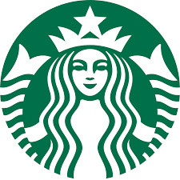

<https://hackerone.com/reports/506646>

## 📌Webshell via File Upload란 무엇인가?

- **취약점 정의**: 서버가 허용하지 않은 확장자의 파일(예: .asp, .php, .jsp)을 업로드할 수 있을 때 발생하는 취약점입니다.
- **핵심 위험**: 공격자가 서버 측 스크립트 파일을 업로드하고 실행할 수 있게 되면, 서버의 권한을 완전히 탈취하는 **RCE(Remote Code Execution)**로 이어집니다.

### 핵심 원리

- 서버는 보통 확장자 기반의 화이트리스트/블랙리스트 검증을 수행합니다.
- 하지만 검증 로직의 허점(예: 특수문자 삽입, 대소문자 변환 등)을 이용하면 필터를 우회하여 악성 파일을 서버에 안착시킬 수 있습니다.

---

## 📌 개요 
- Starbucks의 채용 사이트(ecjobs.starbucks.com.cn)에서 발견된 취약점입니다. 단순한 파일 업로드 기능에서 발생했지만, 윈도우 서버의 특성을 이용한 확장자 필터링 우회를 통해 최종적으로 서버의 제어권을 획득하는 **RCE(Remote Code Execution)**로 이어진 치명적인 사례입니다.

## 📌 취약점 분석 (Root Cause)
- 이 취약점의 핵심은 **"서버가 파일명을 검증하는 방식"**과 "실제 OS가 파일을 저장하는 방식" 사이의 간극을 이용한 것입니다.

1. **WAF 및 서버 사이드 검증 우회**
- 보통 보안 장비나 애플리케이션은 .asp, .aspx, .php 같은 실행 확장자를 차단합니다. 하지만 공격자는 파일 확장자 뒤에 **공백 문자(%20)**를 삽입했습니다.
> 검증 로직: filename.asp (공백 포함)는 .asp와 일치하지 않으므로 필터를 통과할 가능성이 높습니다.

2. **Windows 파일 시스템의 특성**
- 해당 서버는 Windows 기반(ASP.NET)이었는데, Windows 파일 시스템은 파일 이름 끝에 붙은 **공백(Space)이나 마침표(Dot)를 자동으로 제거(Trim)**하고 저장하는 특징이 있습니다.

- 결과적으로 서버는 shell.asp 를 허용하고, **디스크에는 shell.asp로 저장**되어 실행 권한을 가지게 됩니다.

---

## 📌Starbucks 공격의 실제 과정

{: .right}

### 1단계: 악의적 요청 조작

- 공격자는 **Resume 작성 페이지**에서 아바타 이미지를 업로드하며 Burp Suite로 요청을 가로챕니다.

| 단계 | 내용 |
| :--- | :--- |
| **기존 파일명** | `avatar.jpg` |
| **조작된 파일명** | `shell.asp ` (뒤에 공백 한 칸 추가) |

### 2단계: 프론트엔드/WAF 처리

- 보안 장비나 서버 로직은 단순히 끝자리가 `.jpg`가 아니더라도, 공백이 포함된 파일명을 정상적인 이미지 파일로 오인하거나 필터를 통과시킵니다.

### 3단계: 백엔드 처리 (File Storage)

- 윈도우 서버 시스템은 파일 저장 시 끝의 공백을 자동으로 제거합니다.
- 결과적으로 서버에는 `shell.asp`라는 실행 가능한 파일이 생성됩니다.

### 4단계: 요청 실행 (Request Execution)

- 공격자는 업로드된 주소로 접속하여 쿼리 스트링을 통해 OS 명령어를 전달합니다.

```bash
# 서버의 파일 목록을 출력하는 공격 예시
curl -i -s -k -X 'GET' \
 'https://ecjobs.starbucks.com.cn/recruitjob/tempfiles/temp_uploaded_xxx.asp?getsc=dir'

```

### 5단계: 결과 확인 (Command Execution)
- 서버는 **.asp 스크립트**를 실행하여 내부 디렉토리 구조 및 파일 목록을 응답 본문에 포함하여 반환합니다.

<br><br>

## 📌방어 방법
- **확장자 정규화**: 업로드된 파일의 확장자를 체크하기 전, 공백이나 제어 문자를 모두 제거하는 정규화 과정을 거쳐야 합니다.

- **파일명 재생성**: 사용자가 입력한 파일명을 그대로 쓰지 말고, 서버에서 랜덤한 문자열(UUID 등)로 파일명을 강제 변경하여 저장해야 합니다.

- **실행 권한 제한**: 업로드된 파일이 저장되는 디렉토리에서는 스크립트 실행 권한을 완전히 제거해야 합니다.

## 참고
https://hackerone.com/reports/506646

https://owasp.org/www-community/vulnerabilities/Unrestricted_File_Upload

>Reported on: March 8, 2019 / Severity: Critical (9.8)