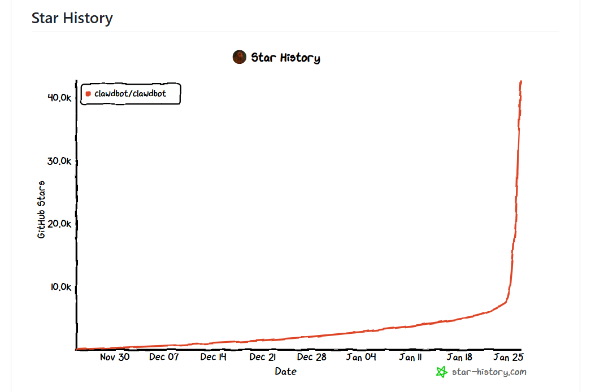

> 2026-01-28 엔트로픽측에서 상표권요청으로 'Moltbot' 으로 이름을 변경했습니다. 본문에는 'Clawdbot'으로 적혀있습니다.

## 📌개요

2026년 1월 26일, 오픈소스 AI 어시스턴트 Clawdbot에서 심각한 보안 취약점이 발견됐다. 보안 연구원 Jamieson O'Reilly는 인증되지 않은 900개 이상의 Clawdbot 게이트웨이가 공개 인터넷에 노출되어 있으며, API 키, 대화 기록, 시스템 접근 권한이 무방비 상태임을 확인했다.

## 📌Clawdbot이란?

- **Clawdbot**은 사용자의 로컬 기기에서 실행되는 개인 AI 어시스턴트로, WhatsApp, Telegram, Discord 등 메시징 앱을 통해 제어할 수 있다. 일반적인 챗봇과 달리 파일 시스템 접근, 브라우저 제어, 셸 명령 실행 등 실제 작업 수행이 가능하며, 대화 컨텍스트를 로컬에 영구 저장한다.

- 1월 26일, 27일 이틀동안 [GitHub](https://github.com/clawdbot/clawdbot) 스타 50K이상 받으며 급속도로 확산됐지만, 그만큼 보안 설정 없이 배포된 인스턴스도 급증했다.



## 📌취약점의 기술적 원인

### 1. Localhost 자동 승인 로직

- Clawdbot의 인증 로직은 127.0.0.1(localhost)에서 오는 요청을 자동으로 승인하도록 설계됐다. 로컬 개발 환경에서는 합리적이지만, **리버스 프록시** 뒤에서 운영될 경우 심각한 문제가 된다.
```
외부 요청 → Nginx/Caddy (프록시) → Clawdbot
                ↑ (127.0.0.1)
```

- 프록시가 모든 외부 요청을 127.0.0.1로 전달하면, Clawdbot은 이를 신뢰할 수 있는 로컬 요청으로 간주하고 인증을 건너뛴다.

### 2. X-Forwarded-For 헤더 무시

- 일반적으로 리버스 프록시는 실제 클라이언트 IP를 `X-Forwarded-For` 헤더에 포함시킨다. 
- 그러나 Clawdbot의 `gateway.trustedProxies` 설정이 기본값으로 비어있어 이 헤더를 검증하지 않는다. 결과적으로 실제 요청 출처를 확인할 방법이 없다.

## 📌발견 과정

- `O'Reilly`는 Shodan을 사용해 Clawdbot Control UI의 고유 HTML 제목 태그를 검색했다. 
- 18789 포트에서 900개 이상의 노출된 **게이트웨이**를 발견했으며, 상당수가 인증 없이 접근 가능한 상태였다.

## 📌노출된 자산

| 접근 유형 | 노출 자산 | 영향 |
|---------|---------|------|
| 설정 읽기 | API 키, OAuth 시크릿, 봇 토큰 | Anthropic, Telegram, Slack 등의 자격증명 탈취 |
| 대화 기록 | 메시지, 첨부파일 | 수개월치 개인 대화 및 파일 유출 |
| 명령 실행 | 셸 접근 권한 | 임의 코드 실행, 시스템 장악 |
| 통합 서비스 | Signal 연결 URI | 메시징 앱 하이재킹 |

특히 일부 인스턴스는 root 권한으로 실행 중이었으며, 이 경우 공격자는 호스트 시스템에 대한 완전한 제어권을 얻을 수 있다.

## 📌공격 시나리오

- **API 키 탈취 및 남용:**
  노출된 Anthropic Claude API 키를 사용해 공격자가 피해자 계정으로 API 호출을 수행하면, 과금이 피해자에게 청구된다.

- **개인정보 유출:**
  대화 기록에는 민감한 개인정보, 업무 내용, 인증 정보 등이 포함될 수 있다. 인증 없이 이에 접근 가능하다.

- **시스템 장악:**
  Clawdbot을 통해 셸 명령을 실행하면 서버 전체를 장악할 수 있다. SSH 키 추가, 백도어 설치 등이 가능하다.

## 📌근본 원인

1. **설계 의도와 실제 사용의 괴리:** 로컬 개인 사용을 전제로 설계됐지만, 사용자들은 24시간 작동하는 서버에 배포했다.

2. **빠른 확산과 문서 부족:** 하루에 9,000 스타를 받으며 급속 성장했지만, 보안 설정 가이드는 충분하지 않았다.

3. **기본값의 위험성:** 보안 설정이 opt-in이 아닌 opt-out 방식이었다. 사용자가 명시적으로 설정하지 않으면 취약한 상태로 남는다.

## 📌대응 방안

### 즉시 조치
```bash
# 노출 여부 확인
clawdbot security audit --deep

# 환경변수로 비밀번호 설정
export CLAWDBOT_GATEWAY_PASSWORD="strong-password-here"
```

### 설정 강화
```yaml
gateway:
  auth:
    mode: "password"
  trustedProxies: ["127.0.0.1"]
```

### 네트워크 격리

- 공개 인터넷 직접 노출 금지
- **Tailscale**, **Cloudflare Tunnel** 등 보안 터널 사용
- VPN 뒤에서만 접근 가능하도록 구성

### 권한 최소화

- root 권한으로 실행 금지
- 필요한 최소 권한만 부여
- 샌드박스 환경에서 실행

## 📌패치
>*2026년 1월 27일 기준*

- O'Reilly가 보안 강화 PR을 제출했으며, 공식 문서에 `trustedProxies` 설정과 프록시 헤더 검증이 추가됐다. 
- 그러나 **2026년 1월 15일 릴리스(2026.1.14-1)**는 이 취약점 발견 이전에 배포된 버전이므로, 기존 사용자는 수동으로 업데이트와 설정 변경이 필요하다.

- 최신 버전에서는 `clawdbot doctor` 명령으로 보안 설정을 점검할 수 있다.

## 📌시사점

- 이 사건은 강력한 기능과 보안의 트레이드오프를 보여준다. Clawdbot이 시스템 전체에 접근할 수 있기 때문에 유용하지만, 바로 그 이유로 위험하다.

- 오픈소스 프로젝트가 급속도로 확산될 때, 보안 교육과 안전한 기본값 설정의 중요성도 함께 강조된다. 특히 AI 에이전트처럼 높은 권한을 요구하는 도구일수록, **Secure by Default 원칙**이 필수적이다.

- 개발자와 사용자 모두 편의성과 보안 사이의 균형을 신중히 고려해야 하며, 프로덕션 환경에 배포하기 전 충분한 보안 검토가 선행돼야 한다.

## 참고

- [Clawdbot GitHub Repository](https://github.com/clawdbot/clawdbot)
- [보안 감사 이슈](https://github.com/clawdbot/clawdbot/issues)
- Jamieson O'Reilly의 X 스레드 (2026년 1월 23일)
- Shodan 검색 결과 분석