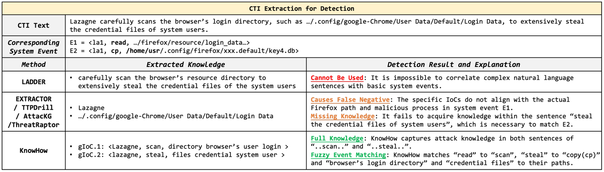
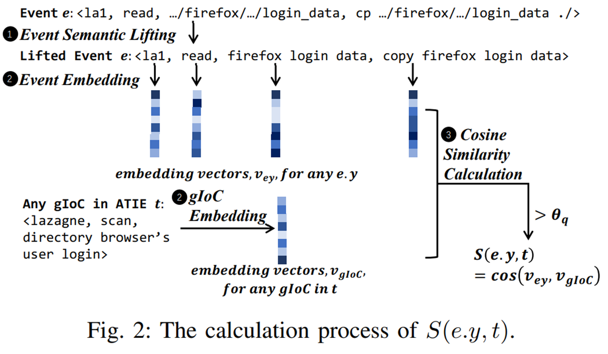
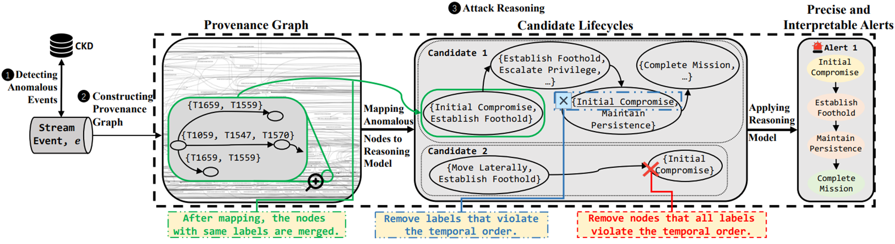
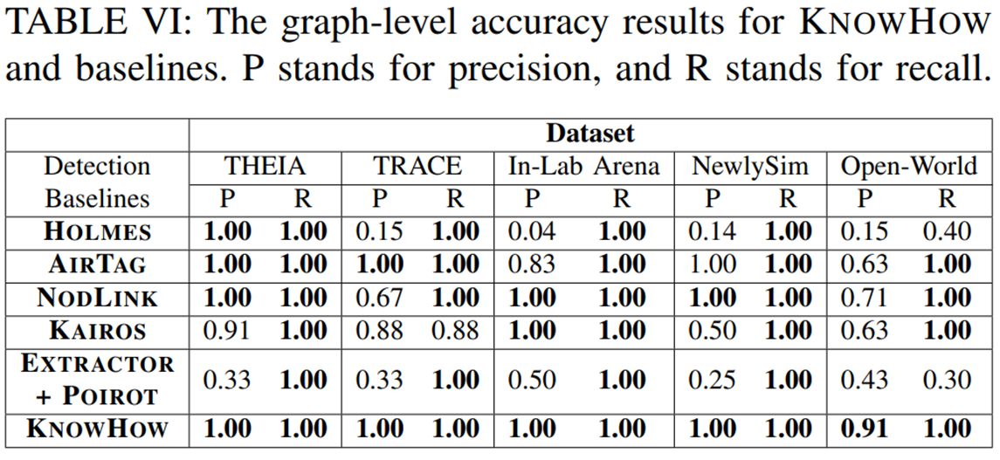

> KnowHow: Automatically Applying High-Level CTI Knowledge for Interpretable and Accurate Provenance Analysis

## 1. CTI 지식과 시스템 로그 사이의 '의미적 격차'
- 사이버 위협 인텔리전스(CTI) 보고서는 고수준의 자연어로 작성되어 있어 APT(지능형 지속 위협) 공격 방어에 유용합니다.  

- 하지만 이를 실제 시스템 로그(파일 접근, IP 조작 등)를 분석하는 탐지 시스템에 곧바로 적용하기는 어렵습니다.  
- 이러한 자연어와 저수준 시스템 이벤트 사이의 **`의미적 격차(Semantic Gap)`**를 자동으로 해결하고, 오탐율이 높았던 기존 방식의 한계를 극복하기 위해 등장한 것이 바로 KnowHow 시스템입니다.

## 2. 배경 
1. 기존 방식의 한계
  - `데이터 중심 접근법`은 오탐이 많고 결과 해석이 어렵다.
  - 반면, 기존의 CTI 기반 방식은 단순한 침해 지표(IoC)(파일명, IP등)에 의존하여 **변종 공격 탐지가 어렵**거나, 전문가가 직접 규칙을 만들어야 하는 **비용 문제 발생**.

2. 시맨틱 갭(Semantic Gap)
  - 자연어로 작성된 CTI 보고서와 저수준 시스템 로그(파일 접근, 네트워크 조작 등) 사이의 **의미적 격차로 인해 자동화된 매칭이 어렵다**.

  

## 3-1. 🔑KnowHow 시스템의 핵심 원리: IoC에서 gIoC로
- 기존의 탐지 시스템들은 특정 악성 파일명이나 IP 주소 같은 정적인 **침해 지표(IoC, Indicator of Compromise)**에 의존했습니다. 
- 하지만 IoC는 **단편적인 '흔적'**에 불과하여, 공격자가 파일 이름이나 IP만 살짝 바꿔도(예: 악성코드 이름을 Lazagne에서 la1으로 변경) 탐지를 쉽게 우회할 수 있는 치명적인 단점이 있었습니다. 또한 "자격 증명 파일을 훔친다"와 같은 중요한 공격 행동의 맥락은 무시되는 한계가 있었습니다.

 

- KnowHow는 이를 극복하기 위해 **gIoC(General Indicator of Compromise)**라는 행위 중심의 새로운 표현 방식을 도입했습니다. 
- 단순히 '어떤 파일이 위험한가'를 기억하는 대신, `SVO 트리플릿 구조`를 통해 "누가, 무엇을, 어디에 했는지"라는 '범행 수법' 자체를 추상화하는 것입니다.
  - **주체(Subject)**: 공격자 그룹, 악성코드 이름, 해킹된 애플리케이션 등 공격을 수행하는 주체 (예: Lazagne) 
  - **행동(Verb)**: '읽기', '복사하기', '스캔하기' 등 구체적인 공격 행위 (예: scan, steal) 
  - **대상(Object)**: 파일 경로, 레지스트리 키 등 공격의 타겟 (예: browser's user login, credential files) 

### 💡 비교 예시 (Lazagne 자격 증명 탈취 공격)

#### 기존 IoC 방식
- `Lazagne (악성 파일명), .../google-chrome/... (특정 브라우저 경로)`만 식별표로 저장합니다. 공격자가 타겟을 Chrome에서 Firefox로 바꾸거나 도구 이름을 변경하면 탐지하지 못합니다.

#### KnowHow의 gIoC 방식
- **<`Lazagne`, `scan`, `browser's user login`>** 형태로 지식을 저장합니다. 특정 Chrome 경로가 아니라 "브라우저의 로그인 디렉터리"라는 일반화된 개념을 사용하므로, 공격자가 Firefox를 공격하더라도 유연하게 변종을 잡아낼 수 있습니다.

  

## 3-2. 🔑KnowHow 시스템의 핵심 원리: 개념적 추상화
### 지식베이스(CKD)와 ATIE
- KnowHow는 추출된 gIoC들을 모아 `CKD`(CTI Knowledge Database)라는 지식베이스를 구축합니다. 
- 이 지식베이스의 기본 단위는 `ATIE`(ATT&CK Technique Information Entry)입니다. 
- ATIE는 특정 공격 기술의 고유 ID(uid), 설명(des), 해당 기술이 언급된 CTI 리포트 목록, 그리고 구체적인 행위 패턴을 담은 gIoC 목록으로 구성된 하나의 '지식 카드'입니다.

### 개념적 추상화(Semantic Lifting)와 변종 탐지
- KnowHow가 알려지지 않은 변종 공격까지 탐지할 수 있는 비결은 **`개념적 추상화`**에 있습니다. 
- 실시간으로 들어오는 `/usr/bin/firefox` 같은 구체적인 시스템 로그 경로를 "browser"라는 **일반적인 개념으로 추상화**시킵니다. 
- 이후 추상화된 로그와 gIoC를 **벡터로 변환**하여 두 벡터 간의 코사인 유사도를 계산하는 `Fuzzy Matching`을 수행합니다. 이를 통해 단어가 완벽히 일치하지 않아도 의미적 유사성을 통해 공격을 잡아낼 수 있습니다.

### 인간의 규칙과 기계학습(LLM, FastText)의 결합
이러한 추상화 과정은 인간이 설계한 규칙과 기계학습 모델의 협업으로 이루어집니다.

- 규칙 테이블(Table I, II): 연구진은 시스템이 로그를 어떻게 추상화할 것인지 정규 표현식과 변환 가이드라인(예: wget -> download)을 직접 정의했습니다.
- LLM의 역할: 규대모 언어 모델(LLM)은 실시간 탐지에는 사용되지 않습니다. 대신 지식베이스를 구축하는 오프라인 단계에서 특정 명사가 도메인인지, 애플리케이션 이름인지, 동의어인지 판단하는 등 복잡한 자연어 처리에 활용됩니다.
- **실시간 처리의 핵심, FastText**: 무수히 쏟아지는 실시간 로그를 추상화하고 매칭하는 데에는 가볍고 빠른 *FastText 임베딩 모델*이 사용됩니다.

### 실시간 매칭 가속화 기술
- 방대한 로그를 실시간으로 처리하기 위해 Mean-Shift 클러스터링 알고리즘을 사용합니다. 
- gIoC들을 의미가 비슷한 것끼리 그룹화해 두고, 로그가 유입되면 가장 유사한 클러스터 내부에서만 검색을 수행하여 탐지 속도를 O(log n) 수준으로 획기적으로 낮췄습니다.

  

## 4. 실시간 매칭과 공격 추론 로직
KnowHow의 전체 탐지 워크플로우는 다음과 같이 진행됩니다.

{: .w-50 .right}
1. **이상 이벤트 탐지**
- 실시간 로그를 개념적으로 리프팅하여 지식베이스(CKD)의 gIoC와 매칭하고, 일치하는 ATT&CK 기술 라벨을 부여합니다.

2. **출처 그래프 구축**: 탐지된 이벤트들을 시드 노드로 삼아 인과 관계 그래프를 그립니다.

3. **공격 추론 (Attack Reasoning)**: 그래프의 노드들을 APT 생명주기 단계로 매핑하고 논리성을 검증합니다.

### 특정 그룹 식별이 아닌 '논리적 완결성' 검증
- KnowHow는 "이것은 특정 APT 그룹의 소행이다"라고 식별(Attribution)하는 모델이 아닙니다. 
- 대신 "이 로그들의 조합이 APT 생명주기에 부합하는가?"를 따져 공격 여부를 탐지(Detection)합니다.

- 경보가 울리려면 엄격한 논리 조건을 통과해야 합니다.

  - **필수 포함 단계**: '초기 침투(Initial Compromise)'와 '거점 구축(Establish Foothold)' 단계가 존재해야 공격으로 판단합니다.
  - **핵심 공격 행위**: 권한 상승, 내부 정찰, 횡적 이동, 지속성 유지 중 최소 하나 이상의 행위가 동반되어야 합니다.
  - **시간적 순서**: '초기 침투'는 반드시 가장 먼저 일어나야 하는 등 시간적 논리가 맞지 않는 노드는 오탐으로 간주하여 그래프에서 제거합니다.

  

## 5. 실험 설계 및 주요 성능 평가 결과
### 실험 데이터셋 (시스템 커널 로그)
- 실험에는 DARPA의 공공 벤치마크 데이터(THEIA, TRACE), 시뮬레이션 데이터(In-lab Arena), 최신 취약점을 활용해 직접 구축한 데이터(NewlySim), 그리고 화웨이 클라우드 180개 엔드포인트에서 수집한 실제 산업 현장 데이터(Open-World) 등 총 5가지 커널 로그 데이터셋이 사용되었습니다.  

- 이 로그들이 쏟아지는 환경에서 실시간으로 APT 시나리오를 탐지해 낼 수 있는지를 평가했습니다.

### 정확도 측정 기준: 그래프 수준 vs 노드 수준

- **그래프 수준 정확도**(Graph-level): 시스템이 거시적인 '공격 캠페인(시나리오) 전체'를 제대로 탐지해 냈는지 측정합니다.

- **노드 수준 정확도**(Node-level): 탐지된 공격 그래프 내의 개별 로그(노드) 단위에서, 정상 로그를 공격으로 오해한 노이즈가 얼마나 적은지 미시적으로 측정합니다. 

>KnowHow는 추론 단계를 통해 논리적으로 맞지 않는 정상 노드들을 쳐내어 이 정확도를 크게 높였습니다.

### ⭐주요 성능 평가 결과
KnowHow는 기존의 SOTA 모델들(HOLMES, AIRTAG, NODLINK, KAIROS 등)과 비교해 압도적인 탐지 정확도를 기록했습니다.

- **그래프 수준 방어율**: Open-World(정밀도 0.91)를 제외한 모든 데이터셋에서 **정밀도와 재현율 모두 1.00(100%)**을 달성하여 모든 공격 시나리오를 완벽하게 탐지했습니다.
- **노드 수준 정밀도**: 다른 모델들이 0.1~0.4 수준의 매우 낮은 노드 정밀도를 보여 정상 로그를 공격으로 오인하는 경우가 많았던 반면, KnowHow는 **0.78~1.00 사이의 압도적인 노드 수준 정밀도**를 유지하며 오탐을 획기적으로 줄였습니다.

{: .w-75}

#### 정리: 왜 KnowHow가 더 잘하는가?

- **미탐 방지**: gIoC를 통해 보고서에 없는 변종 파일명이나 경로를 사용하는 공격도 '의미'로 잡아낸다.
- **오탐 제거**: 공격 추론(Reasoning) 단계에서 시간 순서와 생명주기 논리를 검증하여, 정상적인 관리자의 작업 로그를 공격으로 오해하지 않고 걸러낸다.
- **범용성**: 특정 환경에 종속된 IoC 대신 일반화된 개념을 사용하여, 한 번 구축한 지식으로 다양한 시스템(Linux, Windows 등)의 공격을 탐지할 수 있습니다

## 6. 결론

- KnowHow 시스템은 CTI 보고서의 자연어 지식을 실시간 시스템 로그 분석에 자동으로, 그리고 효율적으로 적용하는 데 성공했습니다. 
- 정적인 IoC의 한계를 gIoC와 개념적 추상화로 넘어서고, 생명주기 논리 추론을 통해 오탐을 극적으로 줄였다는 점에서 큰 의의를 가집니다.

>개인적으로 아쉬운 점이 있다면 결과가 압도적이라 검증 및 사용해보고 싶었지만, 어떤 LLM 모델을 사용했는지 안적혀있어 재현해보기 어려워보인다는 점이네요.  
{: .prompt-info }

관련된 핵심 코드와 활용된 데이터셋은 후속 연구를 위해 GitHub를 통해 공개되어 있습니다.

**Github 링크**: <https://github.com/myh0301/KNOWHOW>

**Paper**: <https://arxiv.org/abs/2509.05698>

**NDSS symposium 2026** : <https://www.ndss-symposium.org/ndss-paper/knowhow-automatically-applying-high-level-cti-knowledge-for-interpretable-and-accurate-provenance-analysis/>